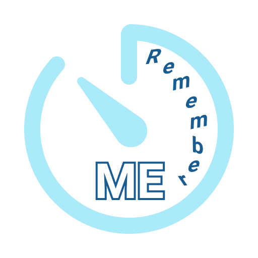
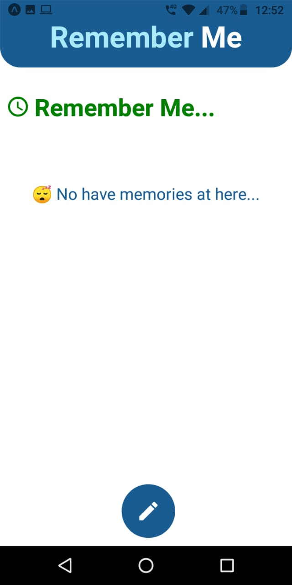
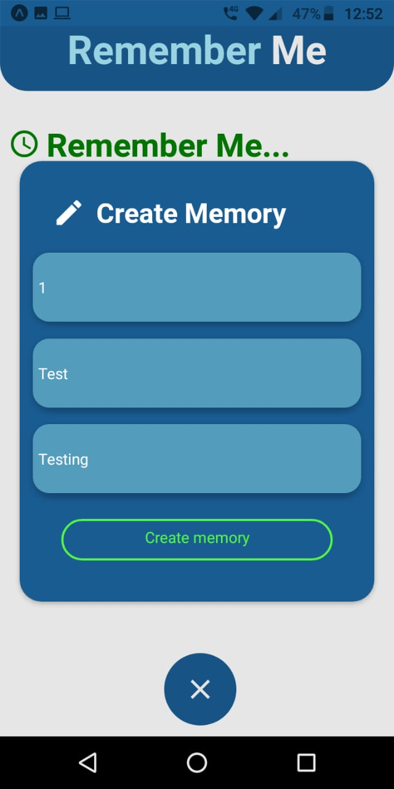
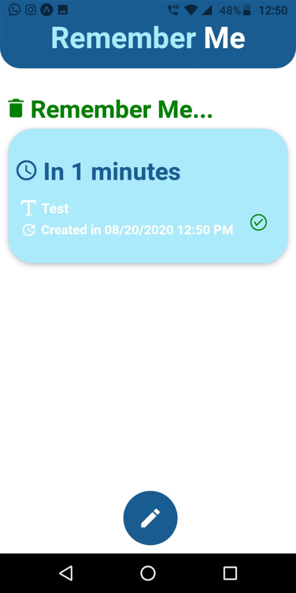
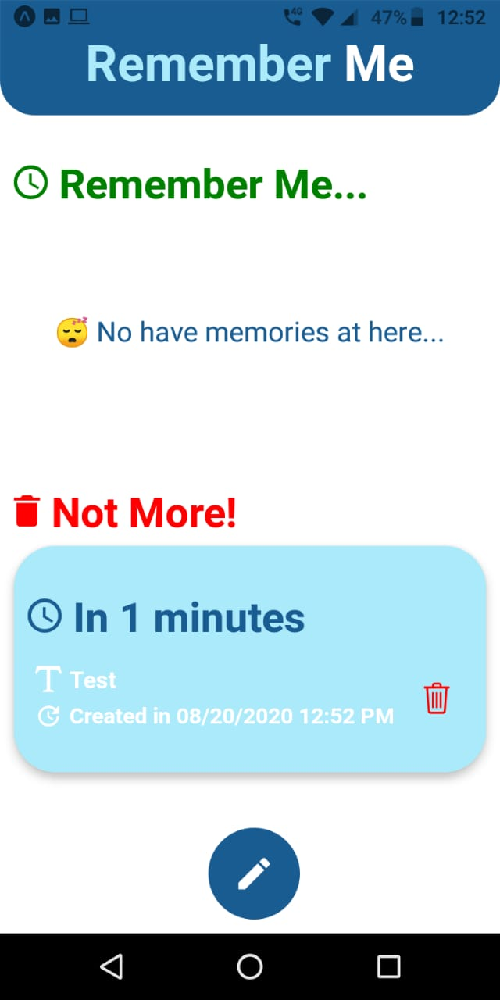
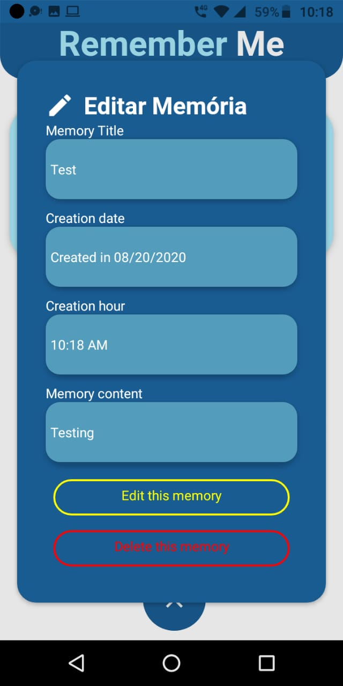
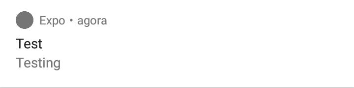

<p align="center">
   
</p>
 
<h1 align="center">Remember ME App</h1>

<p align="center">
	<a href="https://www.linkedin.com/in/luiz-gustavo-56146b1a5/">
      
   </a>
  

  
  <a href="https://github.com/tonicprism/RandomNumberApp#readme">
    
  </a>
   <a href="https://github.com/tonicprism/proffy/commits/master">
      
  </a>
   <a href="https://github.com/tonicprism/RememberMeApp/stargazers">
      
   </a>
</p>

> ⏰ The **Remember Me App** is a app to remember to do some activity in some amount of time.

<p align="center">
    <a href="README.md">English</a>
    ·
    <a href="README-pt.md">Portuguese</a>
</p>

<div align="center">
  <sub>The Remember Me app project. Built with ❤︎ by
    <a href="https://github.com/tonicprism">Luiz Gustavo</a>
  </sub>
</div>

# :pushpin: Table of Contents

- [Technologies](#computer-technologies)
- [How to run](#construction_worker-how-to-run)
- [Issues](#bug-issues)
- [Contributing](#tada-contributing)

### Screenshots

<div float="left">
  
  
  
</div>

<div float="left">
  
  
  
</div>

# :computer: Technologies

This project was made using the follow technologies:

- [React Native](https://reactnative.dev/)
- [Expo](http://expo.io/)

# :rocket: Features

**_🏗 Soon_**

# :construction_worker: How to run

To run the project you need a cellphone with the app of [expo](https://play.google.com/store/apps/details?id=host.exp.exponent) instaled or a emulator android/ios.
<br />
After, fork this repository and clone to your machine. Inside of the project's folder run the following commands:

```sh
# Install Dependencies
$ yarn install

# Run Expo Server
$ yarn start
```

Aferter read the QRCode with the app of [expo](https://play.google.com/store/apps/details?id=host.exp.exponent) or run on emulator.

# :bug: Issues

Feel free to **file a new issue** with a respective title and description on the the [RememberMeApp](https://github.com/tonicprism/RememberMeApp/issues) repository. If you already found a solution to your problem, **i would love to review your pull request**!

# :tada: Contributing

Check out the [contributing](./CONTRIBUTING.md) page to see the best places to file issues, start discussions and begin contributing.

# ✌ Made with 💙 by [Luiz Gustavo](https://github.com/tonicprism/)

Give a ⭐️ if this project helped you!
